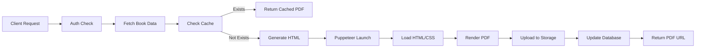

# PDF Generation Guide

**Versiyon:** 3.2 (Puppeteer + HTML/CSS + metin sayfası SVG arka plan)  
**Tarih:** 22 Mart 2026  
**Durum:** Aktif  
**Teknoloji:** Puppeteer + HTML/CSS Template

---

## İçindekiler

1. [Genel Bakış](#genel-bakış)
2. [Teknoloji Stack](#teknoloji-stack)
3. [PDF Format ve Layout](#pdf-format-ve-layout)
4. [Template Yapısı](#template-yapısı)
5. [API Kullanımı](#api-kullanımı)
6. [Geliştirme ve Test](#geliştirme-ve-test)
7. [Spiral Cilt Baskı Düzeni](#spiral-cilt-baskı-düzeni)
8. [Gelecek İyileştirmeler](#gelecek-i̇yileştirmeler)

---

## Genel Bakış

KidStoryBook PDF generation sistemi, çocuk kitaplarını profesyonel bir formatta indirilebilir PDF'lere dönüştürür. Sistem, **Puppeteer + HTML/CSS Template** yaklaşımını kullanarak yüksek kaliteli PDF'ler oluşturur.

### Özellikler

✅ A4 landscape format (297mm x 210mm)  
✅ Double-page spread (her PDF sayfasında 2 A5 dikey sayfa)  
✅ Cover page: Double-page spread (sol: görsel tam köşelere yaslı, sağ: başlık ortalanmış)  
✅ Alternatif görsel-metin düzeni  
✅ 1024x1536 görseller aspect ratio korunarak yerleştirilir  
✅ Görseller sayfa kenarına hizalı (sol sayfa: sola, sağ sayfa: sağa)  
✅ Çocuklara uygun font ve tipografi (18pt, 1.8 line height)  
✅ **Fontlar:** Başlık: Fredoka (Bold), Metin: Alegreya (Regular)  
✅ Metinler sol yaslı ve dikey ortalı  
✅ **Metin yarım sayfalarında** SVG arka plan (#48 “Yıldızlı Kıyı”): `yildizli-kiyi-p48.svg` dosyası **`lib/pdf/generator.ts` içinde HTML’e gömülür** (`.text-page-bg-layer`); Puppeteer’da CSS `background-image` ile data URI dosya yolu güvenilir olmadığı için bu yöntem kullanılır — dashboard ve admin print aynı  
✅ Spread zemin: #ffffff; görsel yarımlar düz beyaz  
✅ Sayfa ortası ayırıcı: kaldırıldı (`spread-container::after` yok)  
✅ Sayfa numaraları sağ altta (sadece metin sayfalarında)  
✅ HTML/CSS ile tam layout kontrolü  
✅ Web font desteği (Google Fonts: Fredoka, Alegreya)  

---

## Teknoloji Stack

### Kullanılan Teknolojiler

- **Puppeteer:** HTML/CSS'den PDF oluşturma (Chromium rendering)
- **HTML/CSS:** Template tabanlı PDF tasarımı
- **TypeScript:** Type safety
- **Node.js:** Server-side PDF generation

### Neden Puppeteer?

**Önceki Yaklaşım (jsPDF):**
- ❌ Manuel layout kontrolü zor
- ❌ Font rendering sorunları
- ❌ SVG desteği sınırlı
- ❌ Text positioning karmaşık
- ❌ Görsel kalitesi düşük

**Yeni Yaklaşım (Puppeteer):**
- ✅ HTML/CSS ile kolay layout kontrolü
- ✅ Web font desteği
- ✅ SVG ve görseller sorunsuz
- ✅ Responsive ve esnek tasarım
- ✅ Yüksek kaliteli render
- ✅ Örnek PDF'lere benzer sonuç

### Storage limit (50 MB) ve görsel sıkıştırma

- **Supabase `pdfs` bucket:** Dosya başına **50 MB** limit. PDF bu limiti aşarsa yükleme **413** hatası verir.
- **Görsel sıkıştırma:** `lib/pdf/image-compress.ts` – API route PDF üretmeden önce kapak ve tüm sayfa görsellerini indirir, **sharp** ile yeniden boyutlandırır (max genişlik) ve JPEG olarak sıkıştırır; data URL ile generator'a verir. Böylece PDF boyutu 50 MB altında kalır.
- **Ayarlar:** `MAX_WIDTH_PX` (görsel max genişlik, px), `JPEG_QUALITY` (80–95). Hedef ~30–40 MB için örn. 2000 px, quality 92. Route: `app/api/books/[id]/generate-pdf/route.ts` (adım 3b).

### Timeout (Puppeteer)

- **Varsayılan:** Puppeteer sayfa yüklemesi için **30 saniye** (navigation timeout). HTML içinde çok sayıda büyük base64 görsel olduğunda `page.setContent()` 30 s içinde bitmeyebilir → **Navigation timeout of 30000 ms exceeded**.
- **Çözüm:** `lib/pdf/generator.ts` içinde `page.setDefaultNavigationTimeout(90_000)` (90 saniye) ayarlandı.

---

## PDF Format ve Layout

### Sayfa Boyutları

```
PDF Sayfası: A4 Landscape
- Genişlik: 297mm
- Yükseklik: 210mm

İçerik Sayfası (Her yarı): A5 Dikey (148.5mm x 210mm)
- Genişlik: 148.5mm (50% of A4 landscape)
- Yükseklik: 210mm (A5 dikey yükseklik)
- Arka plan (spread sayfa zemin): #ffffff
- Görsel yarımlar: padding 0 (tam köşelere yaslı), düz beyaz
- Metin yarımlar: padding 10mm; **arka plan** tam yarım için inline SVG katmanı (`generator.ts` + `yildizli-kiyi-p48.svg`)
```

### Görsel Yerleştirme

- **Aspect Ratio:** Görsellerin en-boy oranı korunur (esnetme yok)
- **Ölçekleme:** Görsel sayfa yüksekliğine göre ölçeklenir, kırpma yapılmaz
- **Hizalama:**
  - Sol sayfadaki görsel: Sola hizalı (`object-position: left center`)
  - Sağ sayfadaki görsel: Sağa hizalı (`object-position: right center`)
- **Spiral Gutter:** En-boy oranı korunduğu için otomatik olarak iç kenarda boşluk oluşur

### Layout Pattern

PDF'deki her sayfa, 2 içerik sayfasını yan yana gösterir. Görsel ve metin alternating pattern ile yerleşir:

```
PDF Sayfa 1: [COVER IMAGE - Full Spread]

PDF Sayfa 2 (Spread 0): [Image | Text]  ← Sayfa 0 ve 1
PDF Sayfa 3 (Spread 1): [Text | Image]  ← Sayfa 2 ve 3
PDF Sayfa 4 (Spread 2): [Image | Text]  ← Sayfa 4 ve 5
PDF Sayfa 5 (Spread 3): [Text | Image]  ← Sayfa 6 ve 7
...
```

**Pattern Mantığı:**
- **Spread index 0, 2, 4...** (çift sayılar): Sol = Görsel, Sağ = Metin
- **Spread index 1, 3, 5...** (tek sayılar): Sol = Metin, Sağ = Görsel

Bu pattern, kitap açıldığında her zaman bir tarafta görsel, diğer tarafta metin olmasını sağlar.

### `pdfLayout`: dashboard vs print

- **`dashboard` (varsayılan):** `POST /api/books/[id]/generate-pdf` — A5 ön kapak → A4 içerik spread’leri → A5 arka kapak. Çıktı S3’e yazılır / `pdf_url` önbelleği.
- **`print`:** `POST /api/admin/books/[id]/generate-pdf` (yalnızca `role: admin`) — Yalnızca **A4 landscape** sayfalar; spiral cilt + **duplex kısa kenar** + kesim için imposizyon (ön yüz normal sıra, arka yüzde sol/sağ ters). Kod: `lib/pdf/generator.ts` (`buildPrintSheets`). PDF doğrudan indirilir (`*_admin-spiral-print.pdf`), önbelleği değiştirmez. Operasyonel rehber: [Spiral Cilt Baskı Düzeni](#spiral-cilt-baskı-düzeni), görsel: `/dev/print-layout-guide.html`.

---

## Template Yapısı

### Dosya Yapısı

```
lib/pdf/
├── generator.ts              # Ana PDF generation logic
├── templates/
│   ├── book-template.html    # HTML template (eski, artık kullanılmıyor)
│   └── book-styles.css       # CSS styles (kullanılıyor)
└── generator.old.ts.bak      # Eski jsPDF generator (backup)
```

### HTML Generation

PDF generator, sayfa verilerinden dinamik HTML oluşturur:

```typescript
// Cover page - Double-page spread (sol: görsel, sağ: başlık)
<div class="page cover-page">
  <div class="spread-container">
    <div class="half-page image-page cover-image-page">
      
    </div>
    <div class="half-page cover-title-page">
      <h1 class="cover-title">Title</h1>
    </div>
  </div>
</div>

// Spread pages
<div class="page spread-page">
  <div class="spread-container">
    <div class="half-page image-page">
      
    </div>
    <div class="half-page text-page">
      <div class="text-content">
        <div class="page-text">Text content...</div>
        <span class="page-number">2</span>
      </div>
    </div>
  </div>
</div>
```

### CSS Styling

**Sayfa Formatı (@page):**
```css
@page {
  size: A4 landscape;
  margin: 0;
}
```

**Arka Plan:**
```css
.spread-page {
  background: #ffffff;
}

.text-page {
  background-color: #ffffff;
  position: relative;
  /* Desen: generator, metin yarımına .text-page-bg-layer + inline <svg> ekler */
}
```

**Not:** Metin deseni **CSS `url()` ile değil**, `generator.ts` → `getTextPageBackgroundSvgInline()` ile okunup HTML’e yazılır. İsteğe bağlı diğer SVG’ler için `embedPdfBackgroundSvgs()` hâlâ `book-styles.css` içindeki `/pdf-backgrounds/*.svg` yollarını base64’e çevirir.

**Köşe pattern:** Kaldırıldı (`.corner-pattern { display: none }`).

**Sayfa ayırıcı:** Orta kesik çizgi kaldırıldı (`.spread-container::after { display: none }`).

**Typography:**
```css
/* Cover Title - Fredoka Bold */
.cover-title {
  font-family: 'Fredoka', sans-serif;
  font-size: 36pt;
  font-weight: 700; /* Bold */
  line-height: 1.3;
}

/* Page Text - Alegreya Regular */
.page-text {
  font-family: 'Alegreya', serif;
  font-size: 18pt;
  font-weight: 400; /* Regular */
  line-height: 1.8;
  color: #1a1a1a;
  text-align: left; /* Sol yaslı */
  justify-content: center; /* Dikey ortalı */
}
```

---

## API Kullanımı

### Endpoint

```
POST /api/books/[id]/generate-pdf
```

### Request

```typescript
// Headers
Authorization: Bearer <supabase_token>

// No body required - book data fetched from database
```

### Response

```typescript
{
  "success": true,
  "data": {
    "pdfUrl": "https://...supabase.co/.../book.pdf",
    "pdfPath": "user_id/books/book_id/book_title_timestamp.pdf",
    "cached": false
  },
  "message": "PDF generated successfully",
  "meta": {
    "generationTime": 15234, // milliseconds
    "pdfSize": 2456789 // bytes
  }
}
```

### PDF Generation Flow



---

## Kod Yapısı

### Ana Dosya: `lib/pdf/generator.ts`

```typescript
// Main function
generateBookPDF(options: PDFOptions): Promise<Buffer>

// Helper functions
generateHTML(options, spreads): string
generateCoverHTML(options): string
generateSpreadHTML(spread): string
prepareSpreads(pages): SpreadData[]
formatText(text): string
escapeHtml(text): string
```

### PDFOptions Interface

```typescript
interface PDFOptions {
  title: string
  coverImageUrl?: string
  coverImageBuffer?: ArrayBuffer
  pages: PageData[]
  theme?: string
  illustrationStyle?: string
}

interface PageData {
  pageNumber: number
  text: string
  imageUrl?: string
  imageBuffer?: ArrayBuffer
}
```

### Puppeteer Configuration

```typescript
const browser = await puppeteer.launch({
  headless: true,
  args: ['--no-sandbox', '--disable-setuid-sandbox'],
})

const pdfBuffer = await page.pdf({
  format: 'A4',
  landscape: true,
  printBackground: true,
  margin: { top: '0mm', right: '0mm', bottom: '0mm', left: '0mm' },
  preferCSSPageSize: true,
})
```

---

## Geliştirme ve Test

### Local Development

1. **Template Değişiklikleri:**
   - `lib/pdf/templates/book-styles.css` dosyasını düzenle
   - CSS değişiklikleri anında yansır (Puppeteer HTML'den okuyor)

2. **Layout Testi:**
   - Test kitabı ile PDF oluştur
   - PDF'i aç ve layout'u kontrol et

3. **Debug:**
   - HTML'i konsola yazdır: `console.log(html)`
   - HTML'i dosyaya kaydet (debug için)

### Performans

**Ortalama Generation Time:**
- 5 sayfalık kitap: ~5-7 saniye
- 10 sayfalık kitap: ~10-15 saniye
- 20 sayfalık kitap: ~20-30 saniye

**PDF Dosya Boyutu:**
- 5 sayfa: ~2-3 MB
- 10 sayfa: ~4-6 MB
- 20 sayfa: ~8-12 MB

**Optimizasyon:**
- Puppeteer browser reuse (gelecek)
- Image compression (CSS ile)
- Parallel processing (gelecek)

---

## Gelecek İyileştirmeler

### Planlanan Özellikler

1. **Web Font Support** ✅ (25 Ocak 2026)
   - ✅ Google Fonts entegrasyonu
   - ✅ Çocuk dostu fontlar: Fredoka (Başlık), Alegreya (Metin)
   - ⏳ Font subsetting (boyut optimizasyonu)

2. **Template Customization**
   - Kullanıcı template seçimi
   - Tema bazlı template'ler
   - **Arka Plan Deseni Seçenekleri:**
     - ✅ **Varsayılan (22 Mart 2026):** Metin sayfaları `yildizli-kiyi-p48.svg` (`bg-alternatives` #48); `generator.ts` HTML’e inline SVG olarak gömer
     - ⏳ Kullanıcı / kitap bazlı pattern seçimi (UI)
     - ⏳ Pattern yoğunluğu ayarı
   - **Arka Plan Rengi Seçenekleri:**
     - Hikaye temasına göre otomatik renk seçimi
     - Kullanıcı arka plan rengi seçimi
     - Tema bazlı renk paletleri (macera: mavi tonları, orman: yeşil tonları, vb.)

3. **PDF Preview** (Faz 5.7.2)
   - İndirmeden önce önizleme
   - Thumbnail'ler
   - Sayfa navigasyonu

4. **PDF Customization** (Faz 5.7.3)
   - Farklı sayfa boyutları (Letter, Square)
   - Farklı layout seçenekleri
   - Sayfa numarası stil seçenekleri

5. **Cover Page İyileştirmeleri**
   - ✅ **Kapak Fotoğrafı Pozisyonlama:** ✅ (25 Ocak 2026)
     - ✅ Double-page spread layout (sol: görsel, sağ: başlık)
     - ✅ Kapak görseli tam köşelere yaslı (sol üst köşeden başlıyor)
     - ✅ Diğer sayfalardaki görsel hizalaması ile aynı mantık
   - **Şirket Bilgisi Ekleme:**
     - [ ] "KidStoryBook ile tasarlanmıştır" gibi branding bilgisi
     - [ ] Logo ve şirket bilgileri yerleşimi
     - [ ] Footer veya alt kısımda şirket bilgisi
   - ✅ **Kapak Metadata Temizleme:** ✅ (25 Ocak 2026)
     - ✅ "adventure • collage" gibi seçilen bilgilerin yer aldığı bölümün kapaktan kaldırılması
     - ✅ Sadece başlık ve görsel kalacak şekilde sadeleştirme

6. **Performance İyileştirmeleri**
   - Browser pool (Puppeteer reuse)
   - Image lazy loading
   - Progressive PDF generation
   - Background job processing

---

## Troubleshooting

### Sık Karşılaşılan Sorunlar

**1. Puppeteer Install Hatası**
```
Sorun: Puppeteer Chromium indirme hatası
Çözüm: 
- npm cache temizle: npm cache clean --force
- Puppeteer'ı yeniden kur: npm install puppeteer
- Alternatif: puppeteer-core kullan + external Chromium
```

**2. Görsel Yüklenmiyor**
```
Sorun: PDF'de görseller görünmüyor
Çözüm:
- Görsel URL'sini kontrol et (public URL olmalı)
- CORS ayarlarını kontrol et
- Puppeteer waitUntil: 'networkidle0' kullanıldığını kontrol et
```

**3. Layout Bozuk**
```
Sorun: Sayfa layout'u yanlış
Çözüm:
- CSS @page kurallarını kontrol et
- HTML structure'ı kontrol et
- Browser devtools ile HTML render'ı test et
```

**4. Font Render Hatası**
```
Sorun: Fontlar doğru render olmuyor
Çözüm:
- Web font URL'lerini kontrol et
- Font loading'i wait et
- Fallback fontlar ekle
```

---

## Karşılaştırma: Eski vs Yeni

### Eski Yaklaşım (jsPDF)

| Özellik | Durum |
|---------|-------|
| Layout Kontrolü | ❌ Zor, manuel |
| Font Rendering | ❌ Sorunlu |
| SVG Desteği | ❌ Yok |
| Text Positioning | ❌ Karmaşık |
| Görsel Kalitesi | ❌ Düşük |
| CSS Desteği | ❌ Yok |

### Yeni Yaklaşım (Puppeteer)

| Özellik | Durum |
|---------|-------|
| Layout Kontrolü | ✅ HTML/CSS ile kolay |
| Font Rendering | ✅ Web font desteği |
| SVG Desteği | ✅ Tam destek |
| Text Positioning | ✅ CSS ile kolay |
| Görsel Kalitesi | ✅ Yüksek |
| CSS Desteği | ✅ Tam destek |

---

---

## Spiral Cilt Baskı Düzeni

> **Görsel rehber:** `public/dev/print-layout-guide.html` → `/dev/print-layout-guide.html`
>
> HTML rehberde **mor sol şerit / A4 #1 rozeti** = tek bir fiziksel A4’ün **ön + arka** yüzü (aynı kutuda üst-alt); **pembe / A4 #2** = ikinci fiziksel A4. İçteki sarı-yeşil-mavi kutular yalnızca **içerik türünü** (kapak / metin / görsel) gösterir.

Bu bölüm, üretilen PDF'i A4 kâğıda arkalı önlü (duplex) basıp ortadan kesmek ve sol kenara spiral takmak suretiyle fiziksel bir çocuk kitabı oluşturmak için gereken baskı düzenini açıklar.

### Hedef: A5 Yaprak + Spiral Cilt

- Her **A4 landscape** kâğıt, ortadan dikey kesilince iki **A5 portrait** yaprak verir.
- Yapraklar soldan spirale takılır; sayfalar sağa doğru çevrilir (normal kitap gibi).
- Bir yaprağı çevirdiğinde: **sol = o yaprağın arkası**, **sağ = bir sonraki yaprağın önü** görünür.

### Yaprak Düzeni (3 hikâye sayfası örneği)

Toplam 8 içerik pozisyonu → 4 A5 yaprak → 2 A4 kâğıt.

| Yaprak | Ön yüz (görünen) | Arka yüz (çevirince sol) | Kaynağı |
|--------|-------------------|--------------------------|---------|
| 1 | Ön Kapak | 1. Hikâye Görsel | Sheet 1, Sol kesim |
| 2 | 1. Hikâye Metin | 2. Hikâye Görsel | Sheet 1, Sağ kesim |
| 3 | 2. Hikâye Metin | 3. Hikâye Görsel | Sheet 2, Sol kesim |
| 4 | 3. Hikâye Metin | Arka Kapak | Sheet 2, Sağ kesim |

### A4 PDF Sayfa Düzeni

**⚠️ Kritik kural:** Kısa kenar (short-edge) duplex baskıda kâğıdı çevirince sol ↔ sağ yer değiştirir. Bu nedenle arka yüz PDF sayfalarında sol ve sağ konum **ters sırada** yerleştirilmelidir.

| PDF Sayfası | Sol Konum | Sağ Konum | Not |
|-------------|-----------|-----------|-----|
| Sheet 1 — Ön | Ön Kapak | 1. Metin | Normal sıra |
| Sheet 1 — Arka | **2. Görsel** | **1. Görsel** | ⚠️ Ters sıra |
| Sheet 2 — Ön | 2. Metin | 3. Metin | Normal sıra |
| Sheet 2 — Arka | **Arka Kapak** | **3. Görsel** | ⚠️ Ters sıra |

### Okuma Akışı

```
Kitap kapalı → Ön Kapak
──────────────────────────────────
1. yaprağı çevir:   [1.Görsel] | [1.Metin]
2. yaprağı çevir:   [2.Görsel] | [2.Metin]
3. yaprağı çevir:   [3.Görsel] | [3.Metin]
Son yaprağı çevir:  [Arka Kapak]
```

### Genel Formüller (N hikâye sayfası)

| Değer | Formül | N=3 |
|-------|--------|-----|
| Toplam içerik pozisyonu | `1 + N×2 + 1` | 8 |
| A5 yaprak sayısı | `N + 1` | 4 |
| A4 kâğıt sayısı | `⌈(N+1)/2⌉` | 2 |
| PDF sayfa sayısı | `A4 × 2` | 4 |

### Epson L8180 Baskı Ayarları

1. PDF'i **Adobe Acrobat Reader** ile aç (tarayıcı duplex ayarları güvenilmez).
2. `Ctrl+P` → Yazıcı: **EPSON L8180**
3. Özellikler → Kâğıt: **A4**, Yön: **Yatay (Landscape)**
4. **⭐ 2-Taraflı Baskı** etkinleştir → Ciltleme: **Kısa Kenar (Short-Edge Binding)**
   - _Uzun Kenar seçersen içerik baş aşağı basılır!_
5. Medya türü: Fotoğraf kâğıdı, Kalite: Yüksek
6. Yazdır — yazıcı otomatik duplex yapar, kâğıda dokunma.
7. Çıkan her A4'ü **148,5 mm** noktasından dikey kes (cetvel + maket bıçağı önerilir).
8. Yaprakları sırala (Yaprak 1→4) ve sol kenardan spiral tak.

> **Kontrol baskısı:** İlk denemede normal kâğıt kullan. Sheet 1'i kes, Yaprak 1 ön=Kapak / arka=1.Görsel olduğunu doğrula.

### Kod: `pdfLayout: 'print'` (uygulandı)

- `generateBookPDF({ ..., pdfLayout: 'print' })` yalnızca A4 `@page spread` üretir (ayrı A5 kapak sayfası yok).
- `buildPrintSheets()` her fiziksel kâğıt için önce **ön yüz** (sol yaprak önü \| sağ yaprak önü), sonra **arka yüz** (short-edge kuralına göre ters sıra).
- İndirme: admin API → `filename`*`_admin-spiral-print.pdf`*.

---

## Referanslar

- **Puppeteer Dokümantasyonu:** https://pptr.dev/
- **CSS @page Spec:** https://www.w3.org/TR/css-page-3/
- **Supabase Storage:** https://supabase.com/docs/guides/storage

---

**Son Güncelleme:** 22 Mart 2026  
**Geliştirici:** KidStoryBook Team  
**Versiyon:** 3.2 (Puppeteer + HTML/CSS + metin sayfası SVG arka plan)

## Son Güncellemeler (22 Mart 2026)

### Yeni Özellikler
- ✅ **Metin sayfası arka planı:** `yildizli-kiyi-p48.svg` → `generator.ts` HTML’e inline SVG (`.text-page-bg-layer`); **dashboard** ve **admin print**
- ✅ **`embedPdfBackgroundSvgs()`:** İsteğe bağlı; CSS’te kalan `/pdf-backgrounds/*.svg` referansları için

## Son Güncellemeler (25 Ocak 2026)

### Yeni Özellikler
- ✅ **A5 Dikey Sayfa Düzeni:** Her yarı sayfa A5 dikey boyutunda (148.5mm x 210mm)
- ✅ **Görsel Hizalama:** Sol sayfada sola, sağ sayfada sağa hizalı
- ✅ **Metin Hizalama:** Ortalanmış paragraflar (`max-width: 38ch`), dikey ortalı
- ✅ **Spread arka planı:** #ffffff
- ✅ **Cover Page Layout:** Double-page spread (sol: görsel tam köşelere yaslı, sağ: başlık ortalanmış)
- ✅ **Cover Metadata Temizleme:** "adventure • collage" gibi metadata kaldırıldı, sadece başlık ve görsel
- ✅ **Font Güncellemeleri:** Başlık: Fredoka (Bold), Metin: Alegreya (Regular) - Google Fonts entegrasyonu

### Gelecek Özellikler
- ⏳ **Kullanıcı / kitap bazlı arka plan deseni:** `public/pdf-backgrounds/` içinde alternatif SVG’ler
- ⏳ **Tema Bazlı Arka Plan Renkleri:** Hikaye temasına göre otomatik renk seçimi
- ⏳ **Kullanıcı Özelleştirme:** Pattern ve renk seçimi için UI
- ⏳ **Şirket Bilgisi:** "KidStoryBook ile tasarlanmıştır" gibi branding bilgisi eklenecek
